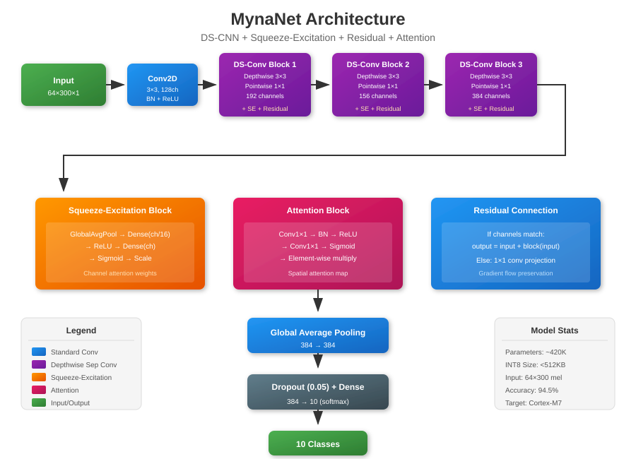

# MynaNet

Lightweight audio-focused CNN for bird call classification on edge devices (Cortex-M7 MCUs).

## Model Architecture

**MynaNet v1: DS-CNN + Squeeze-Excitation + Residual + Multi-Head Self-Attention**



- ~328K parameters (323K trainable)
- 434KB INT8 model size (<512KB target)
- 80×300 mel spectrogram input (3 seconds @ 16kHz)
- Optimized channel progression: [120, 180, 146, 360]
- 2-head MHSA with 88-dim projection

## Best Results (MynaNet v1, Authoritative Linux)

Multiseed results on Linux (3 seeds: 42, 100, 786) with 80:10:10 split:

| Seed | INT8 Accuracy | Model Size |
|------|---------------|------------|
| 42   | 94.00%        | 434KB      |
| 100  | 95.50%        | 434KB      |
| 786  | 95.50%        | 434KB      |
| **Mean** | **95.00% +/- 0.87%** | **434KB** |

For comparison, the wider Model 1e ([80,160,320,640] channels, 4-head MHSA):

| Seed | INT8 Accuracy | Model Size |
|------|---------------|------------|
| 42   | 94.33%        | 529KB      |
| 100  | 94.50%        | 529KB      |
| 786  | 95.17%        | 529KB      |
| **Mean** | **94.67% +/- 0.45%** | **529KB** |

**Key Achievement:** MynaNet v1 achieves **95.00% mean accuracy @ 434KB** -- higher accuracy than the larger Model 1e (94.67% @ 529KB) while remaining 78KB under the 512KB deployment target.

## Training

```bash
# MynaNet v1 (Production Model)
python mynanet_v1.py \
  --splits_csv /path/to/seabird_splits_80_10_10_seed42.csv \
  --flat_dir /path/to/seabird16k_flat \
  --n_mels 80 --dropout 0.05 --mixup 0.2 \
  --warmup_epochs 70 --finetune_epochs 20 \
  --random_seed 42
```

## Dataset

10 Southeast Asian bird species, 600 samples per class (6000 total).
Dataset creation and validation scripts are in [mun3im/seabird](https://github.com/mun3im/seabird).

## Model Evolution

- **v0 (Baseline):** 1e architecture with standard channels [128, 192, 156, 384] → 93.00% @ 481KB
- **v1 (Optimized):** 6% channel reduction [120, 180, 146, 360] + tuned MHSA (88 dims) → **95.00% mean @ 434KB** ✓
- **v1sa (SpecAugment):** v1 + SpecAugment → 94.17% @ 434KB (mixup performs better)
- **v2 (Enhanced MHSA):** v1 + 3 heads, 112 dims → 94.33% @ 477KB (no improvement)

**Production Model:** MynaNet v1 with mixup augmentation (95.00% +/- 0.87% across 3 seeds on Linux)

## Results Directory Structure

```
results_linux/
  v1_dscnn_..._split80:10:10_linux/
    model_int8.tflite          # Quantized model for MCU (434KB)
    model_fp32.keras           # Full precision model
    training_report.txt        # Detailed metrics
    confusion_matrix_int8.png
    training_history.png
```

## License

MIT
