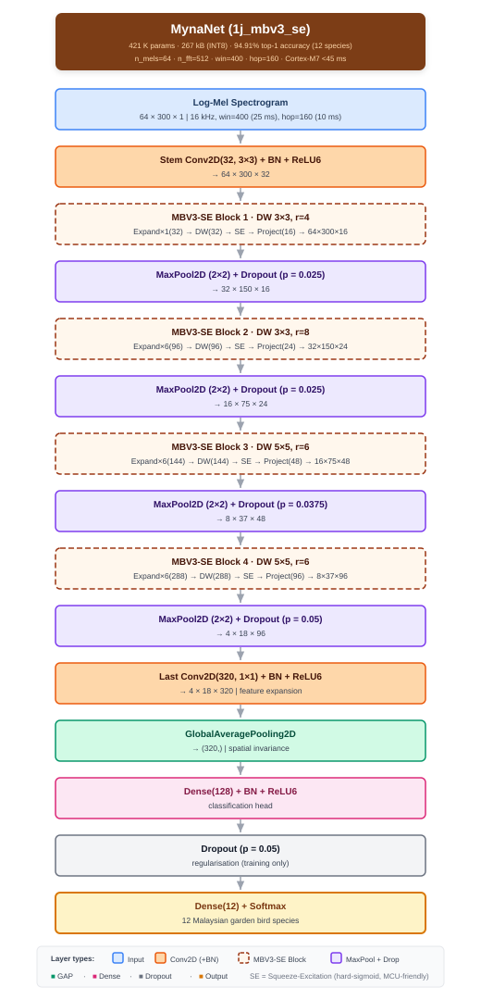

# MynaNet Deploy

End-to-end guide: download dataset → train → quantize → deploy to Arduino Portenta H7.

## Requirements

```bash
pip install tensorflow tf_keras librosa numpy pandas scikit-learn
```

`xxd` must be on your PATH (pre-installed on Linux/macOS).

---

## 1. Download the dataset

**mygardenbird16khz** — 12-class garden bird audio, 16 kHz, ~1,381 sources.

```bash
# Clone the dataset repository
git clone https://github.com/mun3im/mygardenbird
```

The expected layout after cloning:

```
mygardenbird16khz/          ← flat directory of .wav files
metadata16khz/
  splits_mip_80_10_10.csv   ← fixed 80:10:10 train/val/test split
```

Set these paths in the commands below or edit the defaults at the top of `train.py`.

---

## 2. Train MynaNet

`train.py` trains **MynaNet (model 1j)** — 267 KB INT8, 94.91% accuracy on 12-class mygardenbird, fully MCU-deployable on Portenta H7.

```bash
python train.py \
  --flat_dir /path/to/mygardenbird16khz \
  --splits_csv /path/to/metadata16khz/splits_mip_80_10_10.csv \
  --random_seed 42
```

The script trains, evaluates FP32 accuracy, converts to INT8 TFLite, and evaluates INT8 accuracy — all in one run. Results are written to `results_mygardenbird_1_{darwin|linux}/`.

**Authoritative results (Linux/CUDA, 3 seeds):**

| Seed | FP32 % | INT8 % |
|------|--------|--------|
| 42   | 94.03  | 94.31  |
| 100  | 95.14  | **95.42** |
| 786  | 94.58  | 95.00  |
| **mean** | **94.58** | **94.91** |

### Key options

| Flag | Default | Description |
|------|---------|-------------|
| `--random_seed` | 42 | Reproducibility seed |
| `--n_mels` | 64 | Mel bins — 64 is optimal; 48 also tested |
| `--warmup_epochs` | 70 | Cosine-annealed warmup phase |
| `--finetune_epochs` | 20 | Fine-tuning phase |
| `--mixup` | None | Mixup alpha (0.2 recommended) |
| `--force_cpu` | off | Disable GPU |

---

## 3. Quantize to INT8 TFLite

INT8 conversion happens automatically at the end of training. The output file is:

```
results_mygardenbird_1_{platform}/.../model_int8.tflite
```

INT8 conversion runs automatically at the end of training.

---

## 4. Convert to C array for firmware

```bash
bash convert_xxd.sh model_int8.tflite src/mynanet_model_data g_mynanet_model_data
```

Produces two files ready to drop into your Arduino/Mbed firmware project:

```
src/mynanet_model_data.h    ← extern declarations
src/mynanet_model_data.cc   ← alignas(8) const uint8_t array
```

---

## 5. Flash to Portenta H7

1. Copy `mynanet_model_data.h` and `mynanet_model_data.cc` into your firmware project.
2. Link against TFLite Micro (`tensorflow/lite/micro`).
3. Register ops: `AllOpsResolver` or manually register `Conv2D`, `DepthwiseConv2D`, `FullyConnected`, `AveragePool2D`, `MaxPool2D`, `Add`, `Mul`, `ReLU6`, `Softmax`, `Reshape`, `Quantize`, `Dequantize`.
4. Build and flash via Arduino IDE or `arduino-cli`.

> **Note:** `BATCH_MATMUL` (used by Keras `MultiHeadAttention`) is **not** in the TFLite Micro op set on Portenta H7. MynaNet (1j) uses none — it is fully compatible.

---

## Model architecture



```
Conv2D(32, 3×3) + BN + ReLU6                         # Stem
InvRes-SE(t=1, 32→16,  dw=3×3) + MaxPool2D           # Block 1
InvRes-SE(t=6, 16→24,  dw=3×3) + MaxPool2D           # Block 2
InvRes-SE(t=6, 24→48,  dw=5×5) + MaxPool2D           # Block 3
InvRes-SE(t=6, 48→96,  dw=5×5) + MaxPool2D           # Block 4
Conv2D(320, 1×1) + BN + ReLU6                        # Expansion
GlobalAveragePooling2D
Dense(128, relu6) + Dropout(0.05) + Dense(12, softmax)
```

Input: 64 × 300 log-mel spectrogram (16 kHz, 10 ms/frame).  
INT8 size: **267 KB** — within the 512 KB Portenta H7 flash limit.
